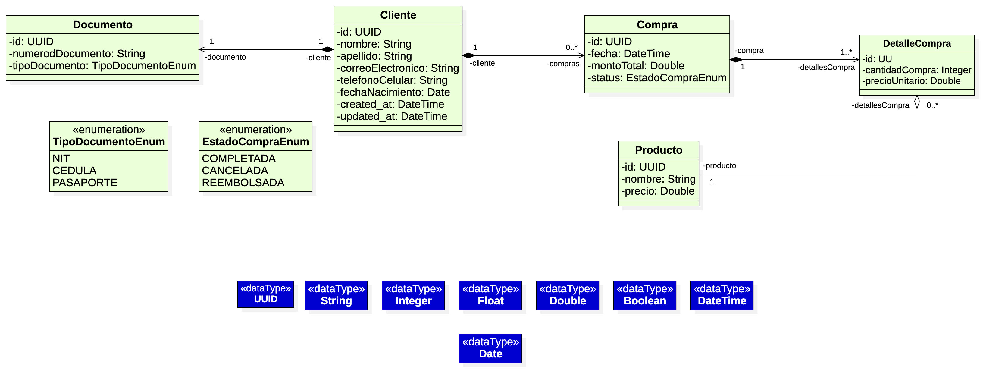

# Rios del Desierto S.A.S - Aplicación de Gestión de Clientes

## Descripción

Aplicación web para la gestión de clientes, compras y reportes de fidelización de Rios del Desierto S.A.S.

### Features:

### 1. Búsqueda de un cliente por tipo y número de documento

Esta funcionalidad permite buscar clientes en el sistema utilizando su tipo y número de documento de identificación. El sistema soporta tres tipos de documentos: **Cédula**, **NIT** y **Pasaporte**.

**Explicación del pantallazo:**
En la captura se puede observar la interfaz de búsqueda de clientes. En la parte superior se encuentra el encabezado con el título "Rios del Desierto S.A.S." y los botones de navegación centrados para alternar entre "Búsqueda de Clientes" y "Reportes de fidelización". El formulario de búsqueda muestra dos campos: un selector desplegable para elegir el tipo de documento (Cédula, NIT o Pasaporte) y un campo de texto para ingresar el número del documento. El botón "Buscar" permite ejecutar la consulta en la base de datos.


### 2. Resultado de una búsqueda de un documento de un cliente

Una vez realizada la búsqueda, el sistema muestra toda la información del cliente encontrado de forma organizada y legible. Esta vista incluye todos los datos personales y del documento del cliente.

**Explicación del pantallazo:**
La captura muestra el resultado exitoso de una búsqueda. Se visualiza una tarjeta (card) con el título "Datos del cliente" que contiene la información completa del cliente encontrado. Los datos se presentan en dos columnas mostrando: tipo de documento, número de documento, nombre, apellido, correo electrónico y teléfono celular. En la parte inferior de la tarjeta se encuentra el botón "Descargar datos" que permite exportar esta información en diferentes formatos. Además, se puede observar que el formulario de búsqueda se ha centrado automáticamente cuando se encuentra un cliente.


### 3. Exportar la información del cliente encontrado en formato CSV, TXT o Excel

Esta funcionalidad permite exportar los datos del cliente a diferentes formatos de archivo para su uso externo, análisis o almacenamiento. El sistema ofrece tres opciones de exportación: CSV (valores separados por comas), TXT (texto plano) y Excel (formato .xlsx).

**Explicación del pantallazo:**
La captura muestra el modal de exportación que aparece al hacer clic en el botón "Descargar datos". El modal presenta tres opciones de formato mediante botones de radio (radio buttons): **EXCEL (.xlsx)**, **CSV (.csv)** y **TXT (.txt)**. El usuario puede seleccionar el formato deseado y luego hacer clic en "Confirmar y descargar" para obtener el archivo. El modal también muestra el nombre del cliente para confirmar que se está exportando la información correcta. En la parte inferior hay botones para cancelar o confirmar la acción.


### 4. Generar reporte de fidelidad de clientes

Esta funcionalidad genera un reporte completo en formato Excel con los clientes que han realizado compras superiores a 5'000.000 COP en el último mes. El reporte incluye información detallada de cada producto comprado por estos clientes fidelizados.

**Explicación del pantallazo:**
La captura muestra la vista de "Reportes de fidelización". En la parte superior se observa el encabezado con los botones de navegación, donde el botón "Reportes de fidelización" está activo (en verde). La sección principal contiene una tarjeta con el título "Reporte de fidelización" que incluye una descripción explicando que el reporte genera un archivo Excel con los datos básicos de cada cliente y el monto total de compras del último mes, incluyendo solo clientes cuyo total supere 5'000.000 COP. En el centro de la tarjeta se encuentra un botón verde "Descargar Excel" que al hacer clic genera y descarga automáticamente el reporte completo con todos los productos comprados por los clientes fidelizados.


## Arquitectura

- **Backend**: Flask + SQLAlchemy (Python 3.11)
- **Frontend**: React + Vite
- **Base de datos**: SQLite (archivo persistente)

## Modelo de Datos

El modelo de datos incluye las siguientes entidades y sus relaciones:

- **Cliente**: Información personal de los clientes
- **Documento**: Documento de identificación (1:1 con Cliente)
- **Compra**: Registro de compras realizadas (N:1 con Cliente)
- **DetalleCompra**: Detalles de productos en cada compra (N:1 con Compra y Producto)
- **Producto**: Catálogo de productos disponibles




## Video de Prueba de funcionamiento

A continuación se muestra un video demostrativo del funcionamiento de la aplicación:

[](https://vimeo.com/1149557052)

<div align="center">
  <a href="https://vimeo.com/1149557052">
    
  </a>
</div>

> **Nota**: Haz clic en la imagen o en el botón para ver el video completo en Vimeo. También puedes descargarlo desde: [docs/EXPLICACION_FINAL_PRUEBA.mp4](docs/EXPLICACION_FINAL_PRUEBA.mp4)

## Requisitos

- Docker
- Docker Compose

## Instalación y Ejecución con Docker

### Opción 1: Usar Docker Compose (Opción Recomendada)

1. **Clonar o navegar al directorio del proyecto**

2. **Construir y ejecutar los contenedores:**
   ```bash
   docker-compose up --build
   ```

3. **Acceder a la aplicación:**
   - Frontend: http://localhost:3000
   - Backend API: http://localhost:8000
   - Health Check: http://localhost:8000/health

## Casos de Uso y Pruebas

### Caso de Uso: Búsqueda de Cliente

Para probar la aplicación, puedes buscar un cliente de ejemplo que viene incluido en el seed:

- **Tipo de documento**: Cédula
- **Número de documento**: `123456789`
- **Cliente**: Juan Pérez

Este cliente tiene compras registradas y puede ser utilizado para probar todas las funcionalidades de la aplicación.

### Exportación de Datos

Una vez que encuentres un cliente, puedes exportar su información en los siguientes formatos:

- **CSV** (`.csv`): Formato de valores separados por comas, ideal para importar en hojas de cálculo
- **TXT** (`.txt`): Archivo de texto plano con formato legible
- **Excel** (`.xlsx`): Formato Excel de Microsoft Office, con formato y estructura de tabla

Para exportar, simplemente haz clic en el botón "Descargar datos" que aparece cuando se encuentra un cliente y selecciona el formato deseado.

### Opción 2: Construir y ejecutar manualmente (NO SE RECOMIENDA)

#### Backend

```bash
cd Backend/rios-del-desierto=backend
docker build -t rios-backend .
docker run -p 8000:8000 -v $(pwd)/instance:/app/instance rios-backend
```

#### Frontend

```bash
cd Frontend/rios-del-desierto-frontend
docker build -t rios-frontend --build-arg VITE_API_BASE=http://localhost:8000/api/v1 .
docker run -p 3000:80 rios-frontend
```

## Comandos Docker Compose Útiles

- **Iniciar servicios**: `docker-compose up`
- **Iniciar en segundo plano**: `docker-compose up -d`
- **Detener servicios**: `docker-compose down`
- **Ver logs**: `docker-compose logs -f`
- **Reconstruir**: `docker-compose up --build`
- **Limpiar todo**: `docker-compose down -v`

## Estructura del Proyecto

```
.
├── Backend/
│   └── rios-del-desierto=backend/
│       ├── Dockerfile
│       ├── requirements.txt
│       ├── run.py
│       ├── instance/
│       │   └── app.db          # Base de datos SQLite
│       └── src/
│           ├── app.py
│           ├── config.py
│           ├── models/
│           └── api/
│               └── v1/
├── Frontend/
│   └── rios-del-desierto-frontend/
│       ├── Dockerfile
│       ├── package.json
│       └── src/
│           ├── App.jsx
│           ├── components/
│           ├── pages/
│           └── utils/
└── docker-compose.yml
```

## Base de Datos SQLite

### Ubicación

La base de datos SQLite se encuentra en:
```
Backend/rios-del-desierto=backend/instance/app.db
```

Este archivo se crea automáticamente cuando se ejecuta la aplicación por primera vez o cuando se ejecutan las migraciones. La carpeta `instance/` es donde Flask almacena archivos específicos de la instancia de la aplicación (como la base de datos en desarrollo).

### Creación y Poblado de la Base de Datos

#### 1. Crear las Tablas (Migraciones)

Primero, es necesario crear las tablas en la base de datos ejecutando las migraciones:

```bash
cd Backend/rios-del-desierto=backend
flask --app run.py db upgrade
```

Este comando aplica todas las migraciones pendientes y crea las tablas necesarias:
- `clientes`
- `documentos`
- `productos`
- `compras`
- `detalles_compra`

#### 2. Poblar la Base de Datos con Datos de Ejemplo (Seed)

Una vez creadas las tablas, puedes poblar la base de datos con datos de ejemplo usando el script de seed:

```bash
cd Backend/rios-del-desierto=backend
python seed_db.py
```

#### ¿Qué hace el seed?

El script `seed_db.py` crea los siguientes datos de ejemplo:

**Clientes:**
- **Juan Pérez** - Cédula: 123456789
  - Compras del último mes que superan 5'000.000 COP
- **María González** - Cédula: 987654321
  - Compras del último mes que superan 5'000.000 COP (6'100.000 COP)
- **Pedro Martínez** - Cédula: 456789123
  - Compras del último mes que NO superan 5'000.000 COP (4'100.000 COP)
- **Ana Rodríguez** - Pasaporte: AB123456
  - Cliente con pasaporte, compra de 2'500.000 COP
- **Empresa Comercial S.A.S.** - NIT: 900123456-7
  - Cliente empresa con NIT, compra grande de 8'500.000 COP

**Productos:**
- Televisor 65 pulgadas: $3'000.000 COP
- Portátil Gamer: $2'500.000 COP
- Barra de Sonido: $600.000 COP

**Compras:**
- Se crean compras de ejemplo para cada cliente
- Algunas compras son del último mes (últimos 30 días)
- Algunas compras son más antiguas (para pruebas)
- Los montos están configurados para probar el reporte de fidelización

#### Notas sobre el Seed

- El script verifica si ya existen datos en la base de datos antes de ejecutarse
- Si ya hay datos, el seed se omite para evitar duplicados
- Para ejecutar el seed nuevamente, primero debes eliminar o limpiar la base de datos
- El seed crea relaciones completas entre clientes, documentos, productos, compras y detalles de compra

## Notas Importantes

- La base de datos SQLite se persiste en `Backend/rios-del-desierto=backend/instance/app.db`
- El backend se inicia primero y el frontend espera a que esté saludable
- El frontend está configurado para comunicarse con el backend en `http://localhost:8000/api/v1`
- Si cambias el puerto del backend, actualiza `VITE_API_BASE` en el Dockerfile del frontend
- En Docker, la base de datos se persiste mediante un volumen montado en `instance/`

## Desarrollo Local (sin Docker)

### Backend

```bash
cd Backend/rios-del-desierto=backend
python -m venv venv
source venv/bin/activate  # En Windows: venv\Scripts\activate
pip install -r requirements.txt
python run.py
```

### Frontend

```bash
cd Frontend/rios-del-desierto-frontend
npm install
npm run dev
```

## Endpoints API

- `GET /` - Mensaje de bienvenida
- `GET /health` - Health check
- `POST /api/v1/clientes` - Crear cliente
- `GET/POST /api/v1/clientes/buscar` - Buscar cliente por documento
- `GET/POST /api/v1/clientes/exportar` - Exportar datos del cliente
- `GET /api/v1/reportes/clientes-fidelizacion` - Reporte de fidelización

